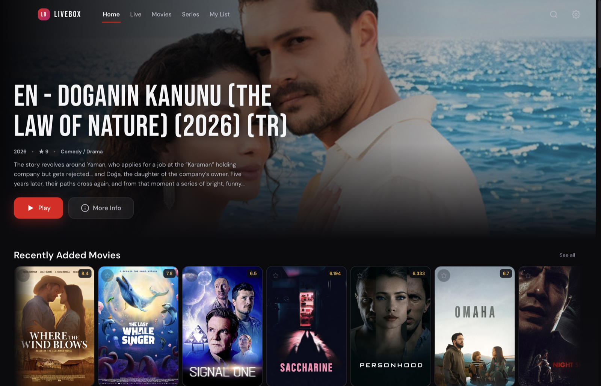
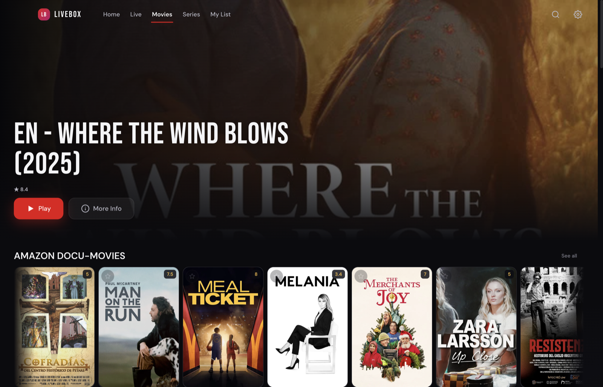
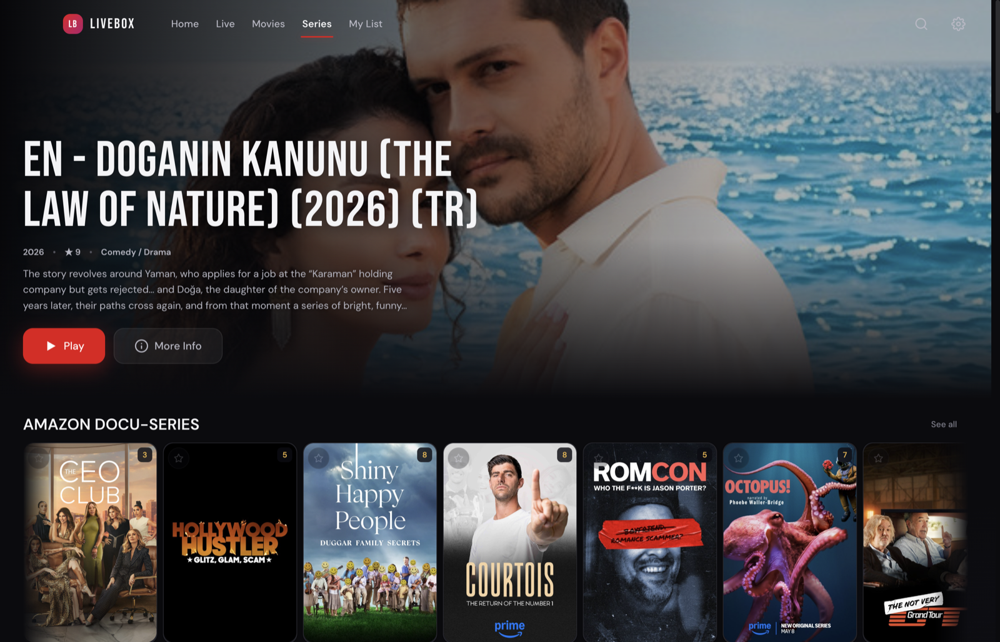

# LiveBox

A modern, native IPTV player for Live TV, Movies, and Series — powered by **mpv/libmpv** so it plays virtually every container and codec (MKV, HEVC, EAC3, redirecting live HLS) that browser `<video>` can't. Built with Electron + React. Supports **Xtream Codes** and plain **M3U / M3U-plus** playlists.


## Screenshots

| Home | Movies | Series |
|------|--------|--------|
|  |  |  |

## Playback engine (mpv / libmpv)

Instead of the browser's `<video>` element, LiveBox renders **all** playback through mpv, so it handles every container/codec, hardware decoding, and the provider quirks typical of IPTV (302-redirecting live HLS, relative segment paths, MKV+EAC3 VOD):

- **macOS** — an in-process **libmpv render-API** native addon draws the video into a view **inside the app window** (true in-window embedding, no separate/floating window). The required libmpv is bundled into the `.app`, so end users don't need anything installed.
- **Windows** — a bundled **mpv** engine renders the video, steered over the player area and controlled over its JSON IPC.

Both platforms share the same in-app controls (the renderer talks to one `mpv.*` contract).

> **Supported OS:** macOS 14 (Sonoma) and newer (Apple Silicon), and Windows 10/11. Linux build scripts exist but the embedded engine isn't officially supported there yet.

## Features

### Content
- **Live TV** — thousands of channels organized by group, with a fast lazy-loaded list
- **Movies** — full VOD library with poster grid, search, and category filtering
- **Series** — season/episode picker; episodes auto-advance
- **Xtream Codes API** — auto-detects Xtream URLs and fetches live, VOD, and series with metadata
- **M3U / M3U-plus** — open a local `.m3u`/`.m3u8` file or load from a URL; entries are classified into Live, Movies, and Series automatically (a plain live-only playlist loads entirely as channels)

### Player
- **Embedded video** with an auto-hiding control dock — play/pause, seek bar, volume, fullscreen
- **Audio & subtitle pickers** — switch tracks from a dropdown; your pick is remembered per movie/episode and applied series-wide
- **Fast keyframe seeking** tuned for HTTP VOD (no decode-lag stalls)
- **Resume playback** — movies and series remember where you stopped
- **Auto-play next** episode for series

### Library & UI
- **Favorites**, **Continue Watching**, and per-series **watch progress** (e.g. "S2E4")
- **Persistent sessions** — credentials, favorites, and history survive restarts
- **Spotlight search** (⌘/Ctrl+K), 8 accent colors, modern dashboard
- **Over-the-air updates** via GitHub Releases (electron-updater)

## Getting started

### Prerequisites
- [Node.js](https://nodejs.org/) v18+ (v20+ recommended)
- **macOS dev:** libmpv + build tools — `brew install mpv dylibbundler` (Homebrew `mpv` ships `libmpv`)
- **Windows dev:** the bundled `mpv.exe` is fetched by CI for packaged builds

### Install & run
```bash
git clone https://github.com/aimen08/livebox.git
cd livebox
npm install

# macOS: build the native libmpv addon once
npm run build:native

npm run dev     # Vite dev server + Electron with hot reload
```

### Build installers
```bash
npm run dist:mac     # macOS arm64 DMG (builds + bundles libmpv)
npm run dist:win     # Windows NSIS installer
```
Releases are also built automatically by GitHub Actions on a `v*` tag (macOS on `macos-14` so the bundled libmpv stays Sonoma-compatible).

### Optional: online subtitle search
LiveBox can fetch subtitles from OpenSubtitles. Supply your own key (free at
[opensubtitles.com/consumers](https://www.opensubtitles.com/en/consumers)):
```bash
export LIVEBOX_OPENSUBTITLES_KEY=your_key_here
```
When unset, online subtitle search is simply disabled.

## Usage
1. Launch the app.
2. **Add Playlist URL** (Xtream or M3U) — or **Open M3U File** for a local playlist.
3. Browse Live / Movies / Series; click anything to play.
4. Star items for Favorites; progress is saved automatically.

Xtream URL format (auto-detected):
```
http://server.com/get.php?username=USER&password=PASS&type=m3u_plus&output=ts
```

## Tech stack

| Component | Technology |
|-----------|------------|
| Desktop shell | Electron |
| UI | React 18 + Vite |
| Playback | mpv / libmpv (native addon on macOS, bundled mpv on Windows) |
| Live HLS fallback | hls.js |
| Packaging | electron-builder, electron-updater |

## Project structure
```
livebox/
├── index.js                 # Electron main: mpv engine, IPC, windows, OTA updates
├── preload.js               # contextBridge IPC API
├── native/                  # macOS libmpv render-API addon (embedded_mpv.mm, binding.gyp)
├── tools/stage-mpv-mac.mjs  # bundles libmpv + deps into the .app
├── src/
│   ├── App.jsx              # root state, routing, playlist loading
│   ├── components/          # Player, TopNav, Billboard, Shelf, PreviewCard, …
│   ├── pages/               # Home, Live, Movies, Series, Favorites, Settings
│   ├── utils/               # m3uParser, storage, contentFilter, db
│   └── styles/global.css
└── .github/workflows/release.yml   # CI: Windows + macOS build & release
```

## Acknowledgements
- [mpv](https://mpv.io/) / libmpv — the playback engine.
- The macOS embedding approach is adapted from [IPTVnator](https://github.com/4gray/iptvnator) (MIT).

## License
[GPL-3.0](LICENSE)
